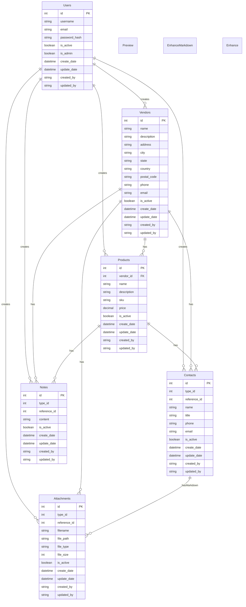

# VMS (Vendor Management System) Documentation

## Overview
This is a comprehensive Vendor Management System built with Flask, providing RESTful APIs for managing vendors, products, contacts, and related resources.

## Core Components

### 1. Main Application (`app/__init__.py`)
- Flask application with multiple blueprints
- Database configuration (SQLAlchemy)
- Migration management
- Authentication (Bcrypt)
- Logging configuration
- API module registration

### 2. Key Models
- **Vendors**: Companies/suppliers
- **Products**: Items associated with vendors
- **Contacts**: Contact information for vendors/products
- **Notes**: Text annotations for vendors/products
- **Attachments**: Files/links associated with vendors/contacts
- **Users**: System users with role-based access control (admin/regular users)

### 3. API Structure
Each module follows RESTful patterns with:
- Flask-RESTX implementation
- CRUD operations
- Token-based authentication
- Structured error handling

## API Endpoints

### Vendor Endpoints (`/v/v1/vendor`)
- GET    /              # List all vendors
- POST   /              # Create new vendor
- GET    /<id>          # Get specific vendor
- PUT    /<id>          # Update vendor
- DELETE /<id>          # Delete vendor

### Product Endpoints (`/p/v1/product`)
- GET    /              # List all products
- POST   /              # Create new product
- GET    /<id>          # Get specific product
- PUT    /<id>          # Update product
- DELETE /<id>          # Delete product
- GET    /vendor/<id>   # Get products by vendor ID

### Contact Endpoints (`/c/v1/contact`)
- GET    /              # List all contacts
- POST   /              # Create new contact
- GET    /<id>          # Get specific contact
- PUT    /<id>          # Update contact
- DELETE /<id>          # Delete contact
- GET    /type/<type_id>/<id>  # Get contacts by type and ID

### Notes Endpoints (`/n/v1/notes`)
- GET    /              # List all notes
- POST   /              # Create new note
- GET    /<id>          # Get specific note
- PUT    /<id>          # Update note
- DELETE /<id>          # Delete note
- GET    /type/<type_id>/<id>  # Get notes by type and ID

### Attachment Endpoints (`/a/v1/attachment`)
- GET    /              # List all attachments
- POST   /              # Upload new attachment
- GET    /<id>          # Get specific attachment
- DELETE /<id>          # Delete attachment
- GET    /download/<id> # Download attachment file
- GET    /type/<type_id>/<id>  # Get attachments by type and ID

### User Endpoints (`/u/v1/user`)
- POST   /register      # Register new user
- POST   /login         # User login
- GET    /profile       # Get user profile
- PUT    /profile       # Update user profile
- PUT    /password      # Change password
- GET    /list          # List all users (admin only)
- PUT    /status/<id>   # Update user status (admin only)
- DELETE /<id>          # Delete user (admin only)

## Additional Features

### 1. Query Parameters
Most GET endpoints support:
- `page`: Pagination page number
- `per_page`: Items per page
- `sort`: Sort field
- `order`: Sort order (asc/desc)
- `search`: Search term

### 2. Type IDs
- Vendor Type (1000)
- Product Type (1001)
- Contact Type (1002)

### 3. Authentication
All endpoints except `/u/v1/user/register` and `/u/v1/user/login` require:
```
Header: Authorization: Bearer <jwt_token>
```

### 4. Response Format
```json
{
  "status": "success|error",
  "message": "Operation message",
  "data": {
    // Response data
  },
  "pagination": {  // For list endpoints
    "page": 1,
    "per_page": 10,
    "total_pages": 5,
    "total_items": 48
  }
}
```

### 5. Error Response Format
```json
{
  "status": "error",
  "message": "Error description",
  "errors": {
    "field": ["Error message"]
  }
}
```

## Environment Configuration
Supports multiple environments:
- Development
- Testing
- Production

Each environment has its own database configuration and settings. 

## Database Schema

The following Entity-Relationship diagram shows the database structure of the VMS:



### Relationship Types:
- `||--o{` indicates a "one-to-many" relationship
- `PK` indicates Primary Key
- `FK` indicates Foreign Key

### Type IDs:
- For Contacts, Notes, and Attachments, the `type_id` field indicates the associated entity:
  - 1000: Vendor
  - 1001: Product
  - 1002: Contact

### Common Fields:
All entities share these audit fields:
- `is_active`: Soft delete flag
- `create_date`: Record creation timestamp
- `update_date`: Record last update timestamp
- `created_by`: User who created the record
- `updated_by`: User who last updated the record 